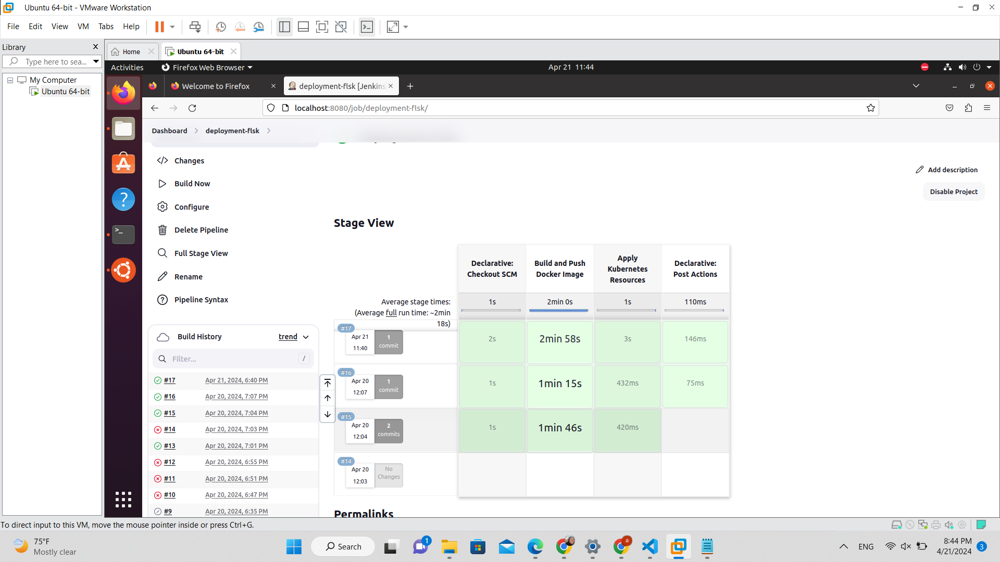
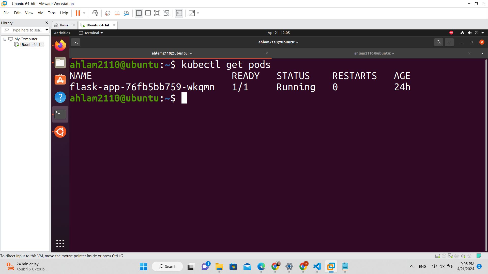

# Jenkins Pipeline with Shared Library: Push and Deploy


This Jenkins pipeline script demonstrates how to use a shared library called `push_deploy` to build and push a Docker image to Docker Hub, and then apply Kubernetes resources using a specified `kubeconfig` file.

### Usage

To use this pipeline script in your Jenkins environment, follow these steps:

1. **Configure Jenkins**: Ensure that your Jenkins instance is properly configured to use shared libraries. You can configure this in the Jenkins global configuration.

2. **Create a Shared Library**: Create a shared library in Jenkins and name it `push_deploy`. This library should contain a script with the functions `buildAndPushDockerImage` and `applyKubernetesResources`.

3. **Import the Shared Library**: In your Jenkins pipeline script, import the `push_deploy` library using the `@Library` directive.

   ```groovy
   @Library('push_deploy') _




# k8s deployment

This repository contains the Kubernetes YAML configuration file for deploying a Flask application.

## Deployment Configuration

The `deployment.yaml` file in this repository defines a Kubernetes Deployment for running a Flask application.



